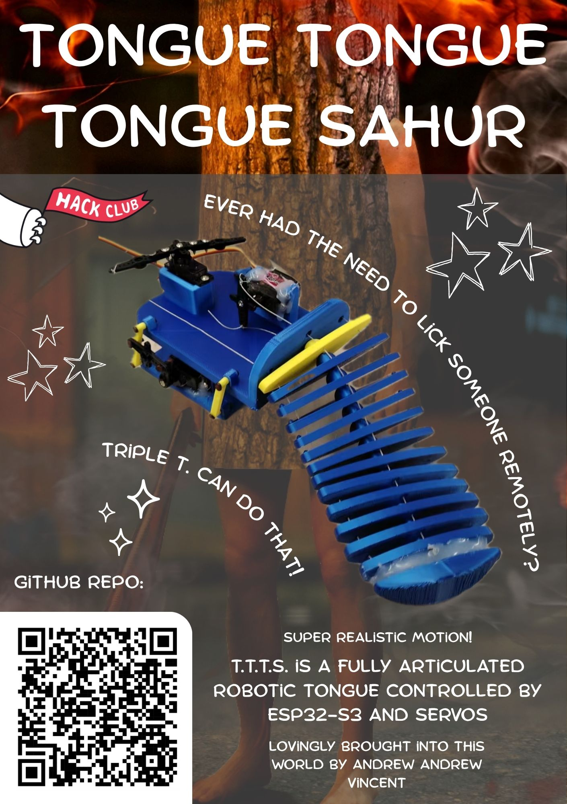
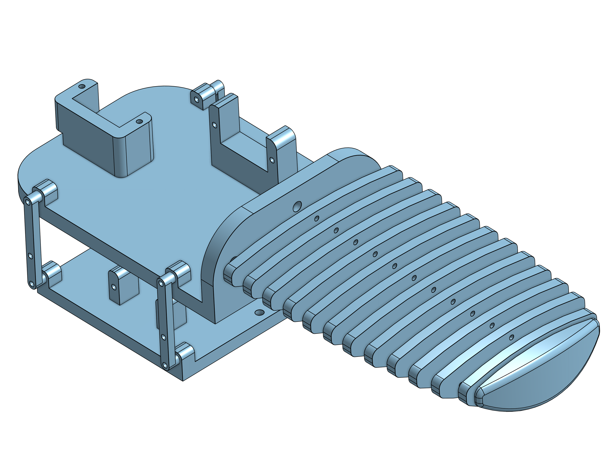

<h1 align="center">
    TongueTongueTongueSahur
</h1>
<h4 align="center">
    A Tongue to keep you company during the apocalypse
</h4>

<h2 align="center">
About this project
</h2>

Tongue Tongue Tongue Sahur is a robotic tongue with three degrees of freedom. Three servos control bending and forwards/backwards movement. Performs pre-programmed routines.

<h2 align="center">
Assembly
</h2>

### Procdure:
 - sort tongue segments according to width, with larger segments closer to base
 - thread ziptie through central hole of segments
 - thread steel fishing line (four in total) through smaller holes and tie to servo
 - base con rod hinges are made from 3D printing filament

### Hardware
#### [Bill Of Materials](/BOM)

### [3D Printed Parts](/List%20Of%203D%20Printed%20Parts.csv)
3D files can be found [here](/Print%20Files/)

### Wiring Diagram

### Assembly Instructions

Here's the Demo!

### Credits
Thank you to:  
[RENRAN SUN](https://github.com/sunrenran)

